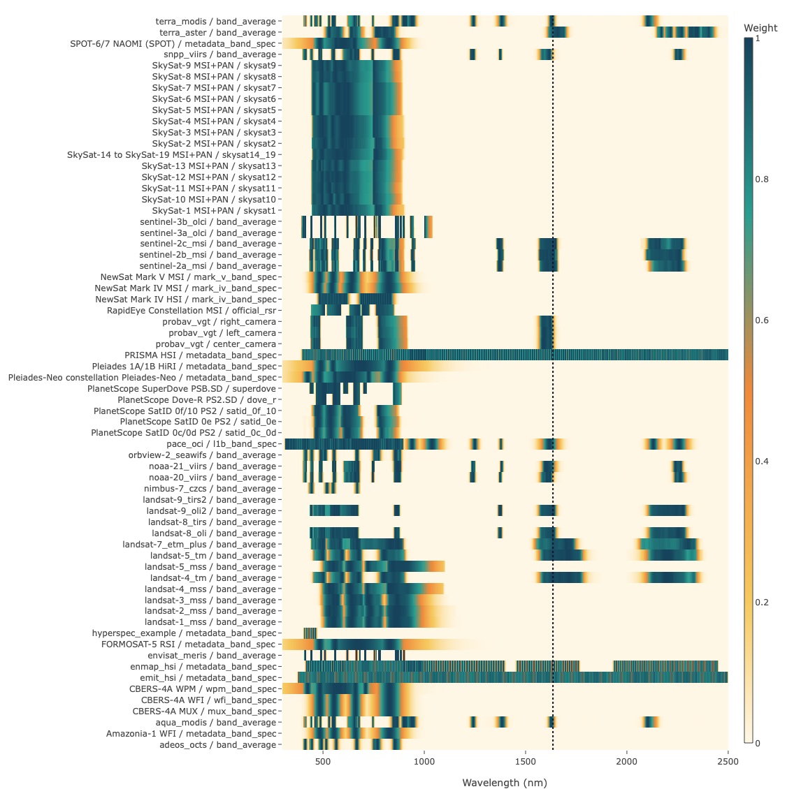

# RSRF



`RSRF` is a repository-backed Python toolkit and curated data repository for canonical optical sensor spectral response definitions.

It keeps the pieces that usually drift apart in one place:

- a read API for sampled response curves and metadata-only band specs
- a CLI for inspection, validation, and registry operations
- manifest-driven ingest and provenance tracking for official upstream artifacts
- checked-in canonical outputs, QA assets, and documentation visualizations

The distribution name is `RSRF`. The import package is `rsrf`.

Documentation: [https://marcyin.github.io/spectral_response/](https://marcyin.github.io/spectral_response/)

Interactive visualization: [https://marcyin.github.io/spectral_response/visualizations/](https://marcyin.github.io/spectral_response/visualizations/)

## What Lives In This Repository

- canonical sampled curves under `data/canonical/sampled_curve/`
- canonical metadata-only band specs under `data/canonical/band_spec/`
- parquet registries under `data/registry/`
- raw, extracted, and manifest-tracked source artifacts under `sources/`
- Python package code under `src/rsrf/`
- MkDocs content and browser visualization assets under `docs/`

The current repository includes both multispectral and hyperspectral coverage, including Sentinel-2, Sentinel-3 OLCI and SLSTR, Landsat, MODIS, VIIRS, ASTER, PlanetScope, SkySat, PROBA-V, PRISMA, EMIT, EnMAP, PACE OCI, Pleiades, FORMOSAT-5, Amazonia-1, and CBERS-4A families.

## Installation

For repository development:

```bash
python3 -m pip install -e ".[dev]"
```

For a minimal install from a checkout:

```bash
python3 -m pip install .
```

Optional extras are split by workflow:

- `.[ingest]` for HDF5, NetCDF, and xarray-based source parsers
- `.[qa]` for validation plots
- `.[docs]` for MkDocs site builds
- `.[release]` for packaging checks
- `.[lint]` for ruff-based code quality checks

The `.[dev]` extra composes all of the above.

## Repository-Backed Data Access

The Python package does not bundle the full canonical repository, raw sources, or parquet registries. Point RSRF at a repository checkout or generated data root with one of these patterns:

- run commands from the repository root
- pass `--root /path/to/repo`
- set `RSRF_ROOT=/path/to/repo`

If neither is supplied, RSRF searches upward from the current working directory for a repository root.

## Quick Start

From a repository checkout:

```bash
python3 -m rsrf --help
export RSRF_ROOT="$PWD"
rsrf show-layout
rsrf list-sensors
rsrf list-bands sentinel-2c_msi --variant band_average
rsrf show-response sentinel-2c_msi B03 --variant band_average
rsrf show-metadata prisma_hsi --variant metadata_band_spec
rsrf validate-sensor sentinel-2c_msi --variant band_average
```

From Python:

```python
from pathlib import Path

from rsrf import get_metadata, list_sensors, load_response_definition

root = Path(".")
sensors = list_sensors(root=root)
metadata = get_metadata("sentinel-2c_msi", "band_average", root=root)
response = load_response_definition("sentinel-2c_msi", "B03", "band_average", root=root)
```

`load_response_definition()` returns either a `SampledCurve` or a `BandSpec`, depending on the representation variant.

## Manifest And Registry Workflows

Manifest-aware commands accept either explicit paths or checked-in manifest filenames from the manifest library. From the repository root, these work without the full manifest path:

```bash
rsrf validate-manifest rsrf_source_manifest_sentinel2c_v2.json
rsrf show-registry-rows rsrf_source_manifest_prisma_hsi_v2.json
rsrf register-manifest rsrf_source_manifest_prisma_hsi_v2.json
```

Planning catalog support is exposed separately:

```bash
rsrf list-planned-sensors
rsrf register-planned-sensors
```

Checked-in manifests live under `sources/manifests/official/`, planning catalogs under `sources/manifests/planning/`, and templates under `sources/manifests/templates/`.

## Data Model

RSRF currently works with two canonical representation types:

- `sampled_curve`: full spectral response samples stored in `curves.parquet`
- `band_spec`: metadata-only band definitions stored in `band_specs.parquet`

Each sensor representation also carries a `metadata.json` sidecar, and sampled-curve variants can include trusted overlay references at:

```text
sources/extracted/<sensor_unit_id>/<representation_variant>/overlay_reference.csv
```

When only metadata-level band specs are available, RSRF can realize approximate sampled curves for QA and visualization workflows.

## Repository Structure

```text
.
|-- data/
|   |-- canonical/
|   |-- common_grid/
|   |-- realized/
|   `-- registry/
|-- docs/
|-- plans/
|-- scripts/
|   |-- build/
|   |-- ingest/
|   `-- validate/
|-- sources/
|   |-- extracted/
|   |-- manifests/
|   |   |-- official/
|   |   |-- planning/
|   |   `-- templates/
|   `-- raw/
|-- src/rsrf/
|   |-- commands/
|   `-- parsers/
`-- tests/
```

Useful code entry points:

- `src/rsrf/api.py` for read-side access to canonical sensor definitions
- `src/rsrf/commands/` for CLI parser, dispatch, and output helpers
- `src/rsrf/ingest.py` for canonical artifact writing and registry updates
- `src/rsrf/manifests.py` for manifest library lookup and path resolution
- `src/rsrf/planning.py` for registry-first planning catalog support
- `src/rsrf/qa.py` for validation reports and plot export
- `src/rsrf/registry.py` for repository layout and parquet registry helpers
- `src/rsrf/visualization.py` and `src/rsrf/docs_site.py` for docs visualization asset export and site preparation

## Documentation

Project documentation is built with MkDocs and published at [https://marcyin.github.io/spectral_response/](https://marcyin.github.io/spectral_response/).

Key entry points:

- getting started: [`docs/getting-started.md`](docs/getting-started.md)
- interactive visualizations: [`docs/visualizations.md`](docs/visualizations.md)
- CLI reference: [`docs/cli.md`](docs/cli.md)
- data model: [`docs/data-model.md`](docs/data-model.md)
- repository layout: [`docs/repository-layout.md`](docs/repository-layout.md)
- development guide: [`docs/development.md`](docs/development.md)
- release guide: [`docs/releasing.md`](docs/releasing.md)

To refresh the generated docs site files and versioned visualization bundles:

```bash
python3 scripts/build/prepare_docs_site.py --root .
```

This refreshes `docs/assets/visualization/`, renders `docs/visualizations.md` from its template, and syncs the versioned JS and CSS bundles referenced by `mkdocs.yml`.

## Development

Run the local verification stack with:

```bash
ruff check src/ tests/ scripts/
ruff format --check src/ tests/ scripts/
python3 -m unittest discover -s tests/unit
python3 -m unittest discover -s tests/regression
python3 scripts/build/prepare_docs_site.py --root .
python3 -m build
python3 -m twine check dist/*
mkdocs build --strict
```

## Project Status

Active design and implementation history lives under `plans/`, including:

- [`plans/rsrf_repo_plan_v3_hyperspectral_support.md`](plans/rsrf_repo_plan_v3_hyperspectral_support.md)
- [`plans/rsrf_implementation_plan.md`](plans/rsrf_implementation_plan.md)
